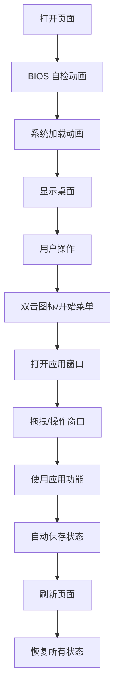

## 1. 产品概述

复刻九十年代经典操作系统界面的前端 Web 应用，提供沉浸式复古桌面体验。包含完整的窗口管理、桌面应用、主题切换和状态持久化功能。

- 目标用户：复古操作系统爱好者、怀旧用户、UI/UX 设计师
- 产品价值：在现代浏览器中重现经典操作系统的交互体验和视觉风格

## 2. 核心功能

### 2.1 功能模块

1. **开机启动画面**：经典 BIOS 自检、系统加载动画、登录界面
2. **桌面环境**：桌面图标、壁纸、右键菜单
3. **任务栏**：开始按钮、运行中应用图标、系统托盘、时钟
4. **开始菜单**：程序列表、设置、关机选项
5. **窗口管理系统**：拖拽、最小化、最大化、关闭、层叠、焦点切换
6. **内置应用集**：
   - 我的电脑：文件浏览
   - 回收站：删除文件恢复
   - 记事本：多文档编辑、保存
   - 画图板：画笔、橡皮、颜色选择、画布
   - 浏览器：模拟网页浏览
   - 扫雷游戏：经典扫雷玩法
7. **主题系统**：多套经典配色主题切换
8. **状态持久化**：所有窗口状态、文档内容刷新后保留

### 2.3 页面详情

| 页面名称 | 模块名称 | 功能描述 |
|---------|---------|---------|
| 启动画面 | BIOS 自检 | 显示硬件检测信息、进度条动画 |
| 启动画面 | 系统加载 | Windows 风格启动动画、进度条 |
| 桌面环境 | 桌面图标 | 6个可双击打开的应用图标 |
| 桌面环境 | 右键菜单 | 刷新、排列图标、属性、主题切换 |
| 任务栏 | 开始按钮 | 点击展开开始菜单 |
| 任务栏 | 应用栏 | 显示最小化/运行中的窗口，点击切换 |
| 任务栏 | 系统托盘 | 音量、网络、时钟显示 |
| 开始菜单 | 程序列表 | 分级菜单显示所有应用 |
| 开始菜单 | 快捷操作 | 运行、帮助、搜索、关机 |
| 窗口系统 | 窗口拖拽 | 按住标题栏可移动窗口 |
| 窗口系统 | 窗口控制 | 最小化、最大化/还原、关闭按钮 |
| 窗口系统 | 焦点管理 | 点击窗口置顶，标题栏高亮 |
| 记事本 | 文档编辑 | 多行文本输入、光标控制 |
| 记事本 | 文件操作 | 新建、打开、保存、另存为 |
| 记事本 | 多窗口 | 支持同时打开多个文档窗口 |
| 画图板 | 绘图工具 | 铅笔、画笔、橡皮、填充 |
| 画图板 | 颜色选择 | 24色调色板、自定义颜色 |
| 画图板 | 画布操作 | 清除、保存图片 |
| 扫雷游戏 | 游戏逻辑 | 经典扫雷规则、难度选择 |
| 扫雷游戏 | 计时器 | 游戏计时、剩余地雷数 |
| 主题系统 | 主题切换 | Windows 95、Windows 98、Windows 2000、经典Mac等主题 |
| 状态持久化 | 自动保存 | 定时保存所有状态到 localStorage |

## 3. 核心流程

## 4. 用户界面设计

### 4.1 设计风格

**视觉风格**：九十年代操作系统复古风格
- **主色调**：Windows 95 经典灰 (#c0c0c0)，带有凸起/凹陷 3D 边框效果
- **强调色**：深蓝色 (#000080) 用于选中状态和标题栏
- **字体**：使用 `MS Sans Serif`、`Tahoma` 或等宽像素字体模拟复古效果
- **按钮样式**：2px 凸起边框，点击时凹陷，带有虚线焦点框
- **窗口样式**：标题栏渐变蓝色，左上角图标，右上角三个控制按钮
- **图标风格**：16x16 / 32x32 像素风格图标，使用 emoji 或 SVG 模拟

**设计细节**：
- 所有控件使用 1px 实线边框，高光 + 阴影模拟 3D 效果
- 任务栏高度 28px，灰色背景，顶部 1px 高光
- 开始按钮带有 Windows 徽标和凸起效果
- 窗口标题栏 20px 高，左侧图标 + 标题，右侧控制按钮
- 桌面图标 32x32 像素，下方文字标签，选中时虚线框

### 4.2 配色主题

| 主题名称 | 主背景色 | 标题栏色 | 选中色 | 描述 |
|---------|---------|---------|-------|-----|
| Windows 95 | #c0c0c0 | #000080 / #1084d0 | #000080 | 经典灰蓝主题 |
| Windows 98 | #c0c0c0 | #0055ee | #000080 | 渐变标题栏 |
| Windows 2000 | #d4d0c8 | #0a246a | #316ac5 | 柔和米色 |
| Windows XP | #ece9d8 | #0a64d8 | #316ac5 | 亮蓝 Luna 主题 |
| 经典 Mac | #d4d0c8 | #000000 | #000000 | 黑白简约 |
| 高对比度 | #000000 | #000000 | #00ffff | 黑底高对比 |

### 4.3 页面设计概述

| 页面名称 | 模块名称 | UI 元素 |
|---------|---------|---------|
| 启动画面 | BIOS 界面 | 黑底白字、等宽字体、ASCII 艺术、闪烁光标、进度条 |
| 启动画面 | 系统加载 | 居中 Logo、进度条、版权信息 |
| 桌面环境 | 桌面区域 | 壁纸图案、图标网格布局、图标文字阴影 |
| 任务栏 | 底部任务栏 | 左侧开始按钮、中间应用按钮、右侧系统托盘 |
| 开始菜单 | 弹出菜单 | 左侧渐变蓝条、右侧程序列表、分隔线、图标 |
| 窗口 | 通用窗口 | 标题栏、图标、控制按钮、边框、内容区域、调整大小手柄 |
| 记事本 | 编辑器 | 菜单栏、工具栏、多行文本框、状态栏 |
| 画图板 | 画布 | 左侧工具栏、底部调色板、中央画布、菜单栏 |
| 扫雷 | 游戏界面 | 顶部数字显示、网格按钮、表情按钮、边框 |

### 4.4 响应式

- **桌面优先**：针对桌面浏览器优化，最小宽度 800x600
- **自适应**：窗口容器占满浏览器视口
- **触摸优化**：支持触摸设备的点击和拖拽操作

### 4.5 动画效果

- 开机 BIOS 文字逐行显示动画
- 启动进度条加载动画
- 窗口打开/关闭时的缩放淡入淡出
- 窗口拖拽时的实时跟随
- 任务栏按钮点击凹陷效果
- 菜单展开/收起的滑动动画
- 桌面图标选中时的虚线框闪烁
- 扫雷格子翻开动画
