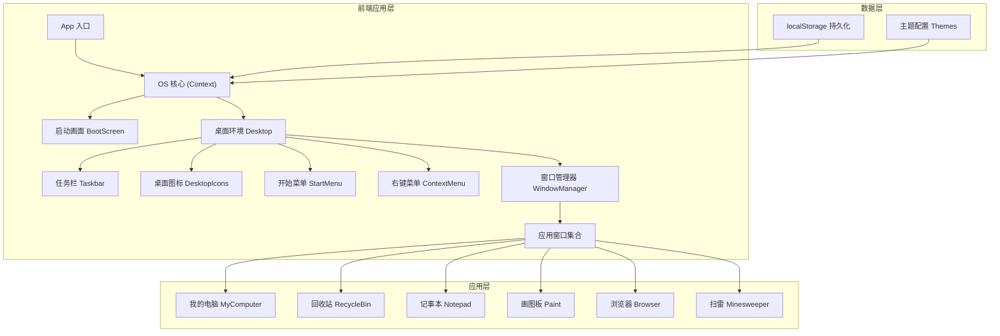

## 1. 架构设计



## 2. 技术描述

### 2.1 技术栈

- **前端框架**：React@18 + TypeScript + Vite@5
- **样式方案**：TailwindCSS@3 + CSS 变量（主题系统）
- **状态管理**：React Context + useReducer
- **图标方案**：emoji + 内联 SVG（模拟像素风格）
- **动画方案**：CSS 动画 + Framer Motion（可选）
- **构建工具**：Vite@5
- **代码规范**：ESLint + Prettier

### 2.2 核心技术选型理由

1. **React Context + useReducer**：替代 Redux，轻量且足够管理 OS 状态
2. **CSS 变量**：主题切换的最佳实践，运行时动态修改
3. **Canvas API**：画图板和扫雷游戏使用 Canvas 实现高性能渲染
4. **localStorage**：状态持久化，无需后端
5. **TailwindCSS**：快速构建 UI，结合自定义 utilities 实现复古风格

## 3. 项目结构

```
src/
├── types/              # TypeScript 类型定义
│   └── os.ts          # 操作系统核心类型
├── context/           # React Context
│   └── OSContext.tsx  # OS 全局状态管理
├── hooks/             # 自定义 Hooks
│   ├── useWindowDrag.ts
│   ├── useLocalStorage.ts
│   └── useTheme.ts
├── themes/            # 主题配置
│   └── index.ts       # 6套经典配色主题
├── components/
│   ├── boot/          # 启动画面
│   ├── desktop/       # 桌面环境
│   ├── taskbar/       # 任务栏
│   ├── startmenu/     # 开始菜单
│   ├── window/        # 窗口组件
│   └── apps/          # 内置应用
│       ├── MyComputer/
│       ├── RecycleBin/
│       ├── Notepad/
│       ├── Paint/
│       ├── Browser/
│       └── Minesweeper/
├── utils/             # 工具函数
├── App.tsx            # 应用入口
├── main.tsx           # React 入口
└── index.css          # 全局样式 + Tailwind
```

## 4. 核心数据模型

### 4.1 窗口状态类型

```typescript
interface WindowState {
  id: string;
  appId: 'mycomputer' | 'recyclebin' | 'notepad' | 'paint' | 'browser' | 'minesweeper';
  title: string;
  icon: string;
  x: number;
  y: number;
  width: number;
  height: number;
  minWidth: number;
  minHeight: number;
  zIndex: number;
  isMinimized: boolean;
  isMaximized: boolean;
  isActive: boolean;
  appState: Record<string, any>;
}

interface OSState {
  bootPhase: 'bios' | 'loading' | 'desktop';
  bootProgress: number;
  windows: WindowState[];
  activeWindowId: string | null;
  zIndexCounter: number;
  theme: string;
  desktopIcons: DesktopIcon[];
  notepadDocs: NotepadDoc[];
  savedPaintings: Painting[];
  showStartMenu: boolean;
  contextMenu: ContextMenuState | null;
}
```

### 4.2 主题配置类型

```typescript
interface Theme {
  id: string;
  name: string;
  colors: {
    desktopBg: string;
    desktopBgPattern?: string;
    taskbarBg: string;
    taskbarText: string;
    windowBg: string;
    windowBorder: string;
    windowTitleBarActive: string;
    windowTitleBarInactive: string;
    windowTitleTextActive: string;
    windowTitleTextInactive: string;
    buttonFace: string;
    buttonHighlight: string;
    buttonShadow: string;
    buttonText: string;
    selectedBg: string;
    selectedText: string;
    menuBg: string;
    menuText: string;
    menuHighlight: string;
    accent: string;
  };
}
```

### 4.3 记事本文档类型

```typescript
interface NotepadDoc {
  id: string;
  name: string;
  content: string;
  createdAt: number;
  updatedAt: number;
  isDirty: boolean;
}
```

## 5. 核心状态管理

### 5.1 Action 类型

```typescript
type OSAction =
  | { type: 'SET_BOOT_PHASE'; payload: 'bios' | 'loading' | 'desktop' }
  | { type: 'SET_BOOT_PROGRESS'; payload: number }
  | { type: 'OPEN_WINDOW'; payload: Partial<WindowState> }
  | { type: 'CLOSE_WINDOW'; payload: string }
  | { type: 'MINIMIZE_WINDOW'; payload: string }
  | { type: 'MAXIMIZE_WINDOW'; payload: string }
  | { type: 'RESTORE_WINDOW'; payload: string }
  | { type: 'FOCUS_WINDOW'; payload: string }
  | { type: 'MOVE_WINDOW'; payload: { id: string; x: number; y: number } }
  | { type: 'RESIZE_WINDOW'; payload: { id: string; width: number; height: number } }
  | { type: 'UPDATE_APP_STATE'; payload: { windowId: string; state: any } }
  | { type: 'SET_THEME'; payload: string }
  | { type: 'TOGGLE_START_MENU' }
  | { type: 'SET_CONTEXT_MENU'; payload: ContextMenuState | null }
  | { type: 'SAVE_NOTEPAD_DOC'; payload: NotepadDoc }
  | { type: 'DELETE_NOTEPAD_DOC'; payload: string }
  | { type: 'LOAD_STATE'; payload: Partial<OSState> };
```

### 5.2 持久化策略

- **存储时机**：每次状态变更后 500ms 防抖保存
- **存储键名**：`retro-os-state-v1`
- **排除字段**：`bootPhase`, `bootProgress`（每次重新启动）
- **恢复时机**：应用初始化时读取 localStorage

## 6. 核心组件说明

### 6.1 窗口管理器 (WindowManager)

- 渲染所有窗口
- 管理 z-index 层级
- 处理窗口焦点切换
- 传递窗口操作事件

### 6.2 可拖拽窗口 (DraggableWindow)

- 使用 `useWindowDrag` hook 实现拖拽
- 标题栏拖拽，边界限制
- 最小化、最大化、关闭按钮
- 调整大小功能（右下角手柄）

### 6.3 记事本 (Notepad)

- `<textarea>` 实现文本编辑
- 多文档管理：内部状态维护当前文档列表
- 文件操作：新建、保存、打开、另存为
- 支持撤销/重做（可选）

### 6.4 画图板 (Paint)

- 使用 `<canvas>` 实现绘图
- 工具：铅笔、画笔、橡皮、填充
- 调色板：24色预设 + 自定义颜色
- 支持不同笔刷大小
- 画布可清除、可导出为 PNG

### 6.5 扫雷游戏 (Minesweeper)

- 游戏逻辑独立于渲染
- 难度：初级(9x9,10雷)、中级(16x16,40雷)、高级(30x16,99雷)
- 使用 Canvas 或 DOM 渲染网格
- 计时器和地雷计数显示

## 7. 路由定义

本项目为单页应用，无外部路由。内部通过窗口状态管理应用切换。

## 8. 性能优化

1. **窗口渲染优化**：最小化的窗口不渲染内容，只保留状态
2. **状态更新防抖**：避免频繁写入 localStorage
3. **Canvas 渲染优化**：画图板使用离屏 Canvas，减少重绘
4. **React.memo**：窗口组件使用 memo 避免不必要重渲染
5. **useCallback**：事件处理函数使用 useCallback 缓存

## 9. 浏览器兼容性

- 目标浏览器：Chrome 90+, Firefox 88+, Safari 14+
- 使用 CSS 变量，不兼容 IE
- 使用现代 JS 特性，通过 Vite 自动转译

## 10. 构建配置

- Vite 端口：5173
- 构建输出目录：`dist/`
- 资源路径：相对路径 `./`
- 不配置后端代理，纯前端应用
